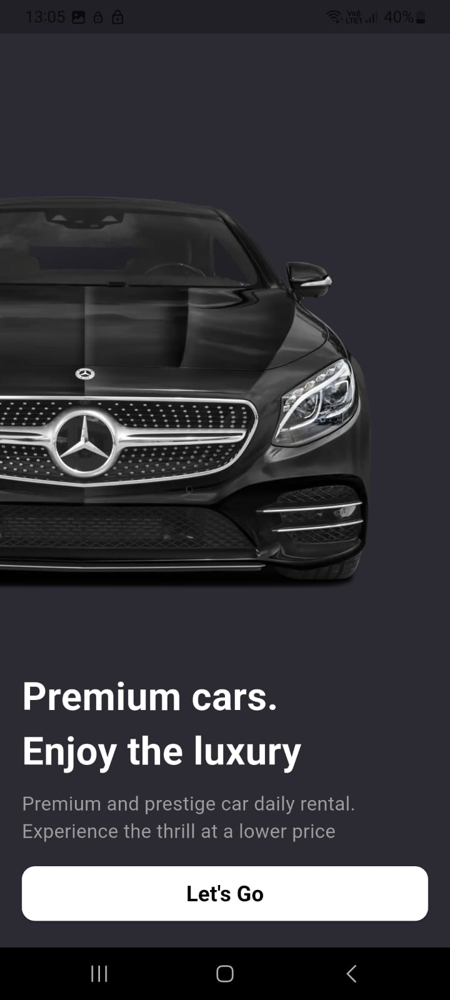
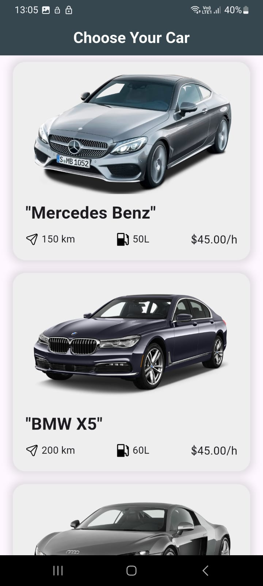
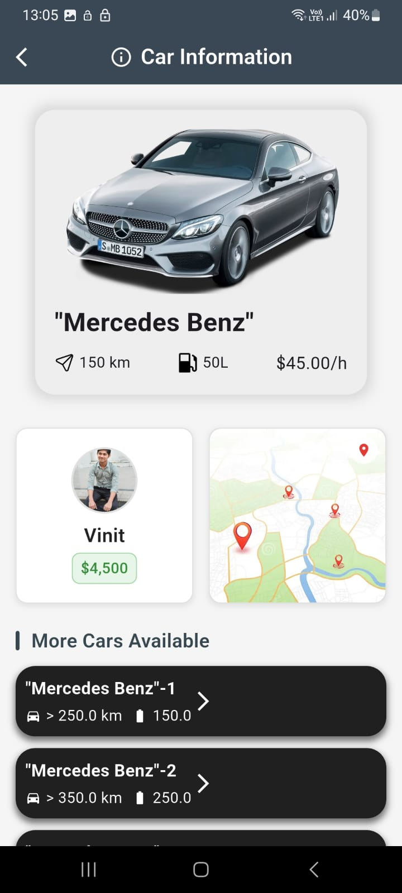
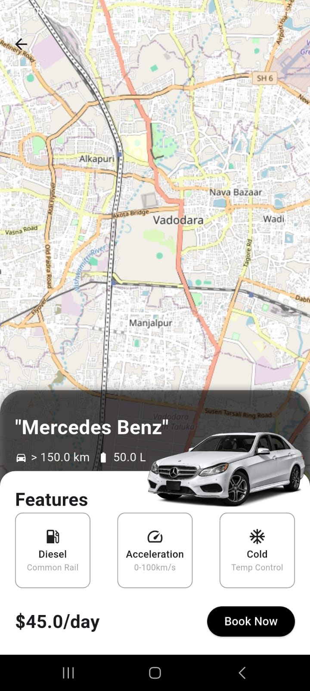

# car_rental_app

My Flutter Car Rental App! 

Built a full-stack mobile application with:

- Clean Architecture (Domain, Data, Presentation layers)

- Firebase Firestore for real-time data

- BLoC state management for scalable UI

- Custom widgets and smooth navigation

- Dynamic car listings with detailed views

- Interactive map integration using Flutter Map

Key learning: Implementing proper separation of concerns and dependency injection made the codebase much more maintainable and testable.

First Page :

Home Page:

Car Information Page:

Car Map Page:

